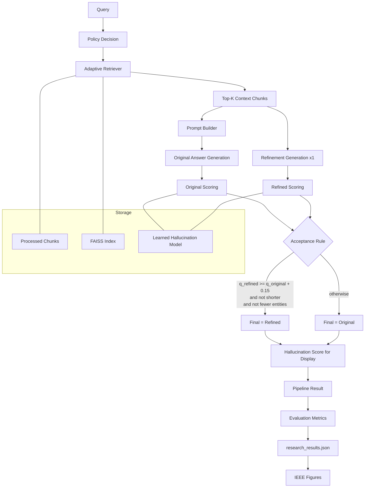

# PARR-MHQA

PARR-MHQA is a multi-hop QA research pipeline built around retrieval, answer generation, one-step refinement, and hallucination analysis. It is designed for fast experimentation and paper-ready reporting.

## What This Project Does

- Loads and preprocesses HotpotQA-style data
- Builds dense embeddings and a FAISS retrieval index
- Generates answers with a local Hugging Face model (Phi-2)
- Runs a stable one-refinement inference flow
- Computes research metrics (EM, F1, hallucination, ECE, LLM calls)
- Produces IEEE-ready evaluation figures from `research_results.json`

## System Architecture



## Inference Flow (Current Stable Mode)

1. Retrieve context
2. Generate original answer
3. Generate one refined answer
4. Compare answer quality only
5. Accept refined answer only if all are true:
   - `q_refined >= q_original + 0.15`
   - refined answer is not shorter
   - refined answer does not contain fewer named entities
6. Compute hallucination score for display/reporting

## Repository Layout

```text
PARR-MHQA/
  app.py
  config.py
  main.py
  run.py
  requirements.txt
  retrieval/
  generation/
  evaluation/
    research_evaluation.py
    metrics.py
    generate_ieee_figures.py
    figures/
  data/
  embeddings/
  models/
  logs/
```

## Quick Start

### 1) Create and activate a virtual environment (PowerShell)

```powershell
python -m venv .venv
(Set-ExecutionPolicy -Scope Process -ExecutionPolicy RemoteSigned)
.\.venv\Scripts\Activate.ps1
```

### 2) Install dependencies

```powershell
pip install -r requirements.txt
```

### 3) Optional environment variables

Create `.env` if you want to set tokens:

```env
HF_TOKEN=your_huggingface_token
```

## Main Commands

### Setup artifacts and index

```powershell
python run.py setup
```

### Train learned hallucination model

```powershell
python run.py train
```

### Run research evaluation

```powershell
python run.py research --n 200
```

### Demo mode (interactive)

```powershell
python run.py demo
```

### Full evaluation mode

```powershell
python run.py evaluate --n 200
```

## Research Outputs

Primary output file:

- `evaluation/research_results.json`

Contains:

- `reports`
  - `llm_only`
  - `heuristic`
  - `learned`
  - `parr_mhqa`
- `ablation`
  - `FULL`
  - `NO_DETECTOR`
  - `NO_MULTI_SIGNAL`

## Generate IEEE Figures

```powershell
python evaluation/generate_ieee_figures.py
```

Generated files:

- `evaluation/figures/fig_main_performance.(png|pdf)`
- `evaluation/figures/fig_reliability.(png|pdf)`
- `evaluation/figures/fig_f1_vs_cost.(png|pdf)`
- `evaluation/figures/fig_ablation.(png|pdf)`

## Notes for Reproducibility

- Random seed is controlled in `config.py` and setup utilities
- Evaluation metrics are computed in `evaluation/metrics.py`
- Keep the same dataset/sample size (`--n`) when comparing runs

## Troubleshooting

- If model downloads are slow or rate-limited, set `HF_TOKEN`
- If PowerShell blocks activation, use process-scoped execution policy as shown above
- If figures look stale, regenerate after re-running research evaluation
